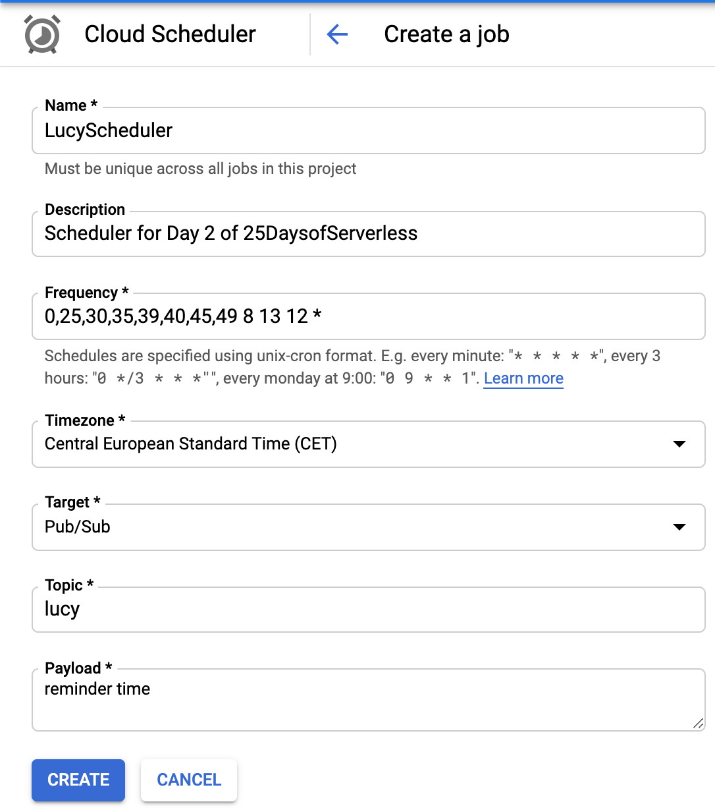
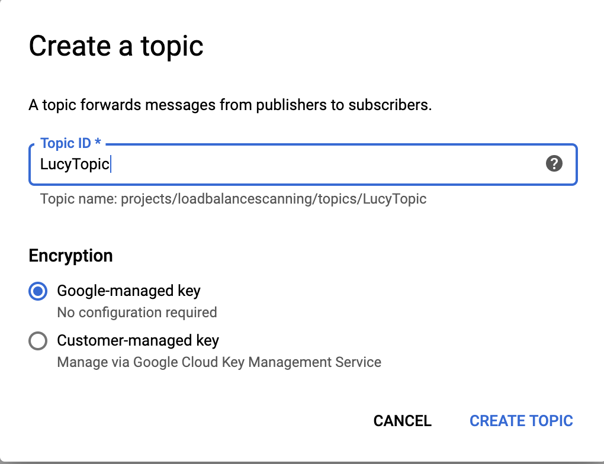
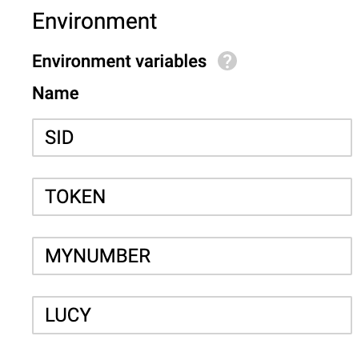

# Challenge:
Create a task scheduler that will tell Lucy exactly when she should relight candles, pour coffee into cups, and deliver batches of coffee. How you want to notify Lucy is up to you: maybe you can send her an SMS via Twilio, or build a webapp that uses WebSockets and browser notifications?

According to the challenge, we have to set several tasks to be scheduled on December 13th. Let's say we start at 8AM, Stockholm time. It might help to sketch out the schedule of tasks to be done:

8:00 AM - start the coffee, set out 4 cups
8:25 AM - pour two cups
8:30 AM - light the candles
8:35 AM - deliver the coffee to Mom and Dad
8:39 AM - return to kitchen, fill two more cups
8:40 AM - relight the candles
8:45 AM - deliver the coffee to Sister and Brother
8:49 AM - return to kitchen, take a break!

Solution to Day 2 of the #25DaysOfServerless. This solution uses Cloud Scheduler, PubSub, and a Cloud Function on GCP. For SMS, I used the Twilio API.

The scheduler runs on a cronjob (shown below), which triggers a pub/sub topic, which triggers the cloud function to send a reminder SMS (using Twilio) to Lucy based on the minute of the hour.

## Preview:

Scheduler

PubSub Topic

Cloud Function ENV variables

